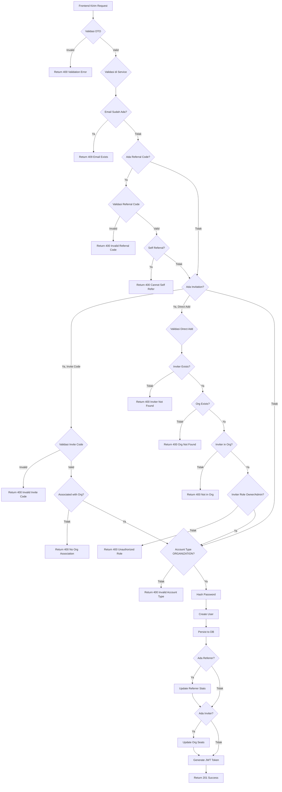

# Summary Logic Registrasi - PsychAPI

## Overview

Dokumentasi ini menjelaskan alur registrasi lengkap dari DTO hingga model, termasuk semua validasi dan payload yang diperlukan untuk frontend.

---

## 1. Endpoint Registrasi

**Endpoint:** `POST /api/v1/auth/register`

**Authentication:** Public (tidak memerlukan token)

---

## 2. Payload Registrasi (RegisterRequest)

### 2.1 Field Wajib (Required)

| Field         | Type          | Validasi                                                                                                                            | Deskripsi                               |
| ------------- | ------------- | ----------------------------------------------------------------------------------------------------------------------------------- | --------------------------------------- |
| `email`       | String        | - Tidak boleh kosong<br>- Format email valid<br>- Max 255 karakter                                                                  | Email user untuk login dan notifikasi   |
| `password`    | String        | - Minimal 8 karakter<br>- Max 100 karakter<br>- Harus ada 1 huruf uppercase<br>- Harus ada 1 huruf lowercase<br>- Harus ada 1 angka | Password untuk authentication           |
| `fullName`    | String        | - Tidak boleh kosong<br>- Minimal 2 karakter<br>- Max 100 karakter                                                                  | Nama lengkap user yang akan ditampilkan |
| `accountType` | String (enum) | - Harus `INDIVIDUAL` atau `ORGANIZATION`                                                                                            | Tipe akun yang akan dibuat              |

### 2.2 Field Opsional (Optional)

#### Referral System

| Field          | Type   | Validasi                                                                | Deskripsi                              |
| -------------- | ------ | ----------------------------------------------------------------------- | -------------------------------------- |
| `referralCode` | String | - Pattern: `^[A-Z0-9]{6,20}$`<br>- 6-20 karakter uppercase alphanumeric | Kode referral dari user yang sudah ada |

#### Invitation System - Option A (Invite Code)

| Field        | Type   | Validasi                                                                      | Deskripsi                                            |
| ------------ | ------ | ----------------------------------------------------------------------------- | ---------------------------------------------------- |
| `inviteCode` | String | - Pattern: `^[A-Z0-9\-]{6,30}$`<br>- 6-30 karakter alphanumeric dengan hyphen | Organization invitation code untuk join organization |

#### Invitation System - Option B (Direct Add)

| Field                   | Type          | Validasi                                                            | Deskripsi                                |
| ----------------------- | ------------- | ------------------------------------------------------------------- | ---------------------------------------- |
| `invitedBy`             | String        | - Pattern: `^[a-fA-F0-9]{24}$`<br>- Valid 24-character ObjectId hex | User ID dari owner/admin yang mengundang |
| `invitedOrganizationId` | String        | - Pattern: `^[a-fA-F0-9]{24}$`<br>- Valid 24-character ObjectId hex | Organization ID yang mengundang          |
| `invitationRole`        | String (enum) | - Harus `member` atau `admin`<br>- Default: `member`                | Role user dalam organization             |

---

## 3. Contoh Payload

### 3.1 Registrasi Individual Account (Tanpa Invitation)

```json
{
  "email": "user@example.com",
  "password": "Password123!",
  "fullName": "John Doe",
  "accountType": "INDIVIDUAL"
}
```

### 3.2 Registrasi Organization Account (Tanpa Invitation)

```json
{
  "email": "admin@company.com",
  "password": "Password123!",
  "fullName": "Company Admin",
  "accountType": "ORGANIZATION"
}
```

### 3.3 Registrasi dengan Referral Code

```json
{
  "email": "user@example.com",
  "password": "Password123!",
  "fullName": "John Doe",
  "accountType": "INDIVIDUAL",
  "referralCode": "JOHN2024"
}
```

### 3.4 Registrasi dengan Invite Code (Option A)

```json
{
  "email": "member@company.com",
  "password": "Password123!",
  "fullName": "New Member",
  "accountType": "ORGANIZATION",
  "inviteCode": "INV-ORG001-ABC"
}
```

### 3.5 Registrasi dengan Direct Add (Option B)

```json
{
  "email": "member@company.com",
  "password": "Password123!",
  "fullName": "New Member",
  "accountType": "ORGANIZATION",
  "invitedBy": "507f1f77bcf86cd799439011",
  "invitedOrganizationId": "507f1f77bcf86cd799439012",
  "invitationRole": "member"
}
```

---

## 4. Validasi di Backend

### 4.1 Validasi di DTO Layer (RegisterRequest)

Validasi ini dilakukan **sebelum** request mencapai service layer:

1. **Mutual Exclusivity: Invite Code vs Direct Add**
   - Tidak boleh menggunakan `inviteCode` DAN `invitedBy/invitedOrganizationId` bersamaan
   - Error: `INVALID_REGISTRATION` - "Cannot use both inviteCode and direct add (invitedBy/invitedOrganizationId) at the same time"

2. **Pasangan Invited By & Organization ID**
   - `invitedBy` dan `invitedOrganizationId` harus ada bersamaan (jika salah satu ada)
   - Error: `INVALID_REGISTRATION` - "invitedBy and invitedOrganizationId must be provided together"

3. **Account Type untuk Invitation**
   - Jika ada invitation (code atau direct add), `accountType` harus `ORGANIZATION`
   - Error: `INVALID_ACCOUNT_TYPE` - "Account type must be ORGANIZATION when using invitation"

4. **Invitation Role hanya untuk Direct Add**
   - `invitationRole` hanya boleh ada jika menggunakan direct add invitation
   - Error: `INVALID_REGISTRATION` - "invitationRole can only be set when using direct add invitation"

### 4.2 Validasi di Service Layer (UserService.register)

Validasi ini dilakukan **setelah** request mencapai service layer:

1. **Validasi Data User**
   - Email tidak boleh kosong
   - Format email harus valid: `^[A-Za-z0-9+_.-]+@[A-Za-z0-9.-]+\.[A-Za-z]{2,}$`
   - Email max 255 karakter
   - Password minimal 8 karakter
   - Password max 100 karakter
   - Full name minimal 2 karakter
   - Full name max 100 karakter

2. **Validasi Email Uniqueness**
   - Email belum terdaftar di database
   - Error: `EMAIL_EXISTS` - "Email '<email>' is already registered"

3. **Validasi Referral Code (jika ada)**
   - Referral code harus valid dan ada di database
   - Error: `INVALID_REFERRAL_CODE` - "Referral code '<code>' is not valid"
   - Tidak boleh menggunakan referral code sendiri (self-referral)
   - Error: `INVALID_REFERRAL` - "Cannot use your own referral code"

4. **Validasi Invite Code (jika menggunakan Option A)**
   - Invite code harus valid dan ada di database
   - Error: `INVALID_INVITE_CODE` - "Invitation code '<code>' is not valid"
   - Invite code harus terasosiasi dengan organization
   - Error: `INVALID_INVITE_CODE` - "Invitation code '<code>' is not associated with any organization"

5. **Validasi Direct Add (jika menggunakan Option B)**
   - User yang mengundang (`invitedBy`) harus ada di database
   - Error: `INVALID_INVITER` - "User who invited you does not exist"
   - Organization (`invitedOrganizationId`) harus ada di database
   - Error: `INVALID_ORGANIZATION` - "Organization does not exist"
   - User yang mengundang harus belong ke organization tersebut
   - Error: `UNAUTHORIZED` - "User does not belong to this organization"
   - User yang mengundang harus memiliki role `owner` atau `admin`
   - Error: `UNAUTHORIZED` - "Only organization owner or admin can add members directly. Your role: <role>"

---

## 5. Response Sukses

**Status Code:** `201 Created`

```json
{
  "success": true,
  "message": "Registration successful",
  "data": {
    "user": {
      "id": "507f1f77bcf86cd799439011",
      "email": "user@example.com",
      "fullName": "John Doe",
      "profilePicture": null,
      "roles": ["USER"],
      "accountType": "INDIVIDUAL",
      "organizationId": null,
      "organizationRole": null,
      "subscriptionTier": "free",
      "status": "active",
      "createdAt": "2026-07-20T10:00:00Z"
    },
    "token": "eyJhbGciOiJIUzI1NiIsInR5cCI6IkpXVCJ9...",
    "expiresIn": 604800
  },
  "meta": null,
  "code": null,
  "errors": null
}
```

---

## 6. Response Error

### 6.1 Validation Error (400 Bad Request)

```json
{
  "success": false,
  "message": "Validation error message",
  "data": null,
  "meta": null,
  "code": "ERROR_CODE",
  "errors": [
    {
      "field": "email",
      "message": "Email is required"
    }
  ]
}
```

### 6.2 Conflict Error (409 Conflict) - Email Sudah Terdaftar

```json
{
  "success": false,
  "message": "Email 'user@example.com' is already registered",
  "data": null,
  "meta": null,
  "code": "EMAIL_EXISTS",
  "errors": null
}
```

### 6.3 Invalid Referral Code (400 Bad Request)

```json
{
  "success": false,
  "message": "Referral code 'INVALID123' is not valid",
  "data": null,
  "meta": null,
  "code": "INVALID_REFERRAL_CODE",
  "errors": null
}
```

### 6.4 Invalid Invite Code (400 Bad Request)

```json
{
  "success": false,
  "message": "Invitation code 'INVALID123' is not valid",
  "data": null,
  "meta": null,
  "code": "INVALID_INVITE_CODE",
  "errors": null
}
```

### 6.5 Unauthorized Direct Add (400 Bad Request)

```json
{
  "success": false,
  "message": "Only organization owner or admin can add members directly. Your role: member",
  "data": null,
  "meta": null,
  "code": "UNAUTHORIZED",
  "errors": null
}
```

---

## 7. Alur Registrasi (Flow Diagram)



---

## 8. Checklist Implementasi Frontend

### 8.1 Form Validation (Client-Side)

- [ ] Email format validation
- [ ] Password strength validation (min 8 chars, uppercase, lowercase, number)
- [ ] Full name min/max length validation
- [ ] Referral code pattern validation (6-20 uppercase alphanumeric)
- [ ] Invite code pattern validation (6-30 alphanumeric with hyphens)
- [ ] ObjectId pattern validation untuk invitedBy dan invitedOrganizationId

### 8.2 Business Logic Validation (Client-Side)

- [ ] Mutual exclusivity: inviteCode vs invitedBy+invitedOrganizationId
- [ ] invitedBy dan invitedOrganizationId harus ada bersamaan
- [ ] accountType harus ORGANIZATION jika ada invitation
- [ ] invitationRole hanya boleh ada jika direct add

### 8.3 Error Handling

- [ ] Handle 400 Validation Error dengan menampilkan field-specific errors
- [ ] Handle 409 Email Exists dengan message yang jelas
- [ ] Handle 400 Invalid Referral Code
- [ ] Handle 400 Invalid Invite Code
- [ ] Handle 400 Unauthorized untuk direct add

### 8.4 Success Flow

- [ ] Simpan JWT token dari response
- [ ] Simpan user data dari response
- [ ] Redirect ke dashboard/home page setelah registrasi sukses

---

## 9. Catatan Tambahan

### 9.1 Auto-Generated Fields

Setelah registrasi sukses, user akan mendapatkan:

- `referralCode`: Auto-generated dari email dan timestamp (format: 3 huruf pertama email + timestamp)
- `roles`: Default `["USER"]`, untuk ORGANIZATION menjadi `["USER", "ORGANIZATION"]`
- `subscriptionTier`: Default `"free"`
- `status`: Default `"active"`
- `revenueSharePercentage`: Default `0`
- `referralIds`: Empty array `[]`
- `totalReferrals`: Default `0`
- `successfulReferrals`: Default `0`
- `referralEarnings`: Default `0.0`

### 9.2 Organization-Specific Fields

Untuk user dengan `accountType: ORGANIZATION`:

- `organizationRole`: Default `"owner"`
- `invitationStatus`: Default `"accepted"`
- `invitationAcceptedAt`: Timestamp saat registrasi

### 9.3 Referral System

Jika user mendaftar dengan referral code:

- Referrer akan mendapatkan update pada `referralIds`, `totalReferrals`
- User baru akan mendapatkan `referredBy` dan `referredAt` ter-set

### 9.4 Invitation System

Jika user mendaftar dengan invitation:

- User akan mendapatkan `invitedBy`, `invitedOrganizationId`, `invitationStatus`, `invitationRole`
- Organization akan mendapatkan update pada `seatsUsed`

---

## 10. File Referensi

| File     | Path                                                                                           | Deskripsi                        |
| -------- | ---------------------------------------------------------------------------------------------- | -------------------------------- |
| DTO      | [`AuthRequests.java`](../src/main/java/com/psycorp/psychapi/api/dto/AuthRequests.java:19)      | RegisterRequest dan LoginRequest |
| Resource | [`AuthResource.java`](../src/main/java/com/psycorp/psychapi/api/resource/AuthResource.java:47) | Endpoint registrasi              |
| Service  | [`AuthService.java`](../src/main/java/com/psycorp/psychapi/domain/service/AuthService.java:65) | Business logic orchestrator      |
| Service  | [`UserService.java`](../src/main/java/com/psycorp/psychapi/domain/service/UserService.java:76) | Implementasi registrasi detail   |
| Model    | [`User.java`](../src/main/java/com/psycorp/psychapi/domain/model/User.java:19)                 | User entity dengan semua field   |
